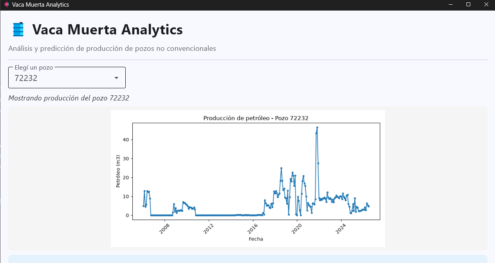
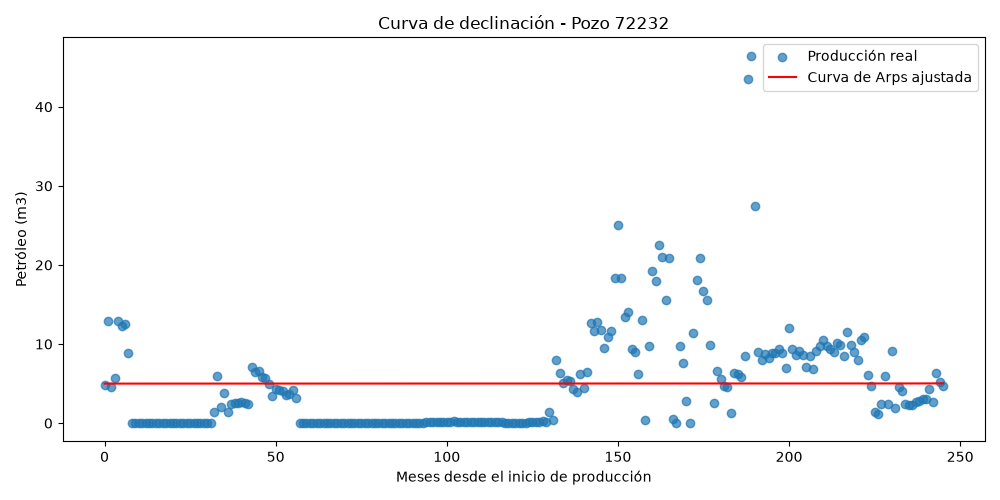
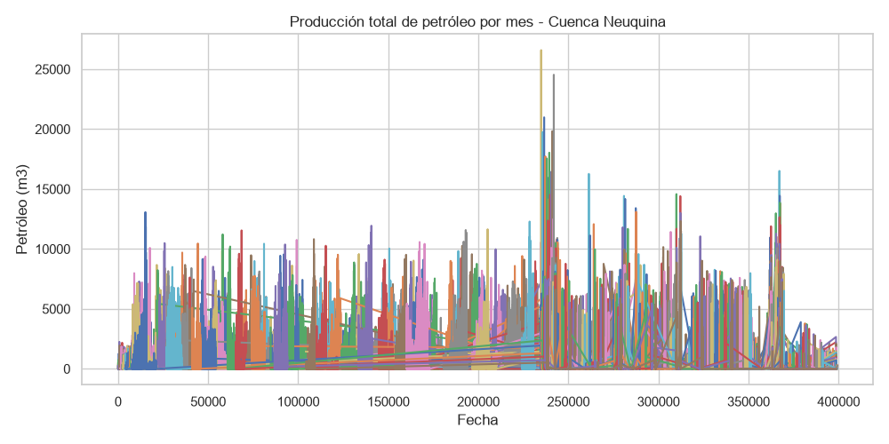

# 🛢️ Vaca Muerta Analytics

**Pipeline de ciencia de datos de punta a punta sobre producción real de petróleo y gas no convencional en Vaca Muerta (Argentina)** — desde la ingesta de datos públicos hasta un dashboard interactivo con reportes generados por IA.


---

## 📖 Índice

- [Sobre el proyecto](#-sobre-el-proyecto)
- [Demo / Capturas](#-demo--capturas)
- [Arquitectura del pipeline](#-arquitectura-del-pipeline)
- [Fuente de datos](#-fuente-de-datos)
- [Stack tecnológico](#-stack-tecnológico)
- [Estructura del repositorio](#-estructura-del-repositorio)
- [Instalación y uso](#-instalación-y-uso)
- [Metodología](#-metodología)
- [Resultados](#-resultados)
- [Desafíos técnicos y aprendizajes](#-desafíos-técnicos-y-aprendizajes)
- [Roadmap / próximos pasos](#-roadmap--próximos-pasos)
- [Autores](#-autores)
- [Licencia](#-licencia)

---

## 🎯 Sobre el proyecto

**Vaca Muerta** es una de las formaciones de shale (petróleo y gas no convencional) más importantes del mundo, ubicada en la cuenca Neuquina, Argentina. Este proyecto analiza datos reales y públicos de producción, publicados mensualmente por la **Secretaría de Energía de la Nación**, para responder preguntas de negocio reales de la industria:

- ¿Cómo evolucionó la producción de la región en los últimos años?
- ¿Qué operadoras dominan la producción?
- ¿Cómo se comporta la curva de declinación de un pozo no convencional a lo largo de su vida útil?
- ¿Se puede predecir la producción futura de un pozo con Machine Learning?
- ¿Se puede automatizar la comunicación de estos hallazgos a un público no técnico usando IA generativa?

El proyecto cubre el flujo completo de un trabajo de datos real: **ingesta → limpieza → análisis exploratorio → modelado estadístico → Machine Learning → generación de lenguaje natural con LLMs → visualización interactiva.**

---

## 🎥 Demo / Capturas





---

## 🏗️ Arquitectura del pipeline

```
┌─────────────────┐    ┌──────────────────┐    ┌─────────────────┐
│  1. Ingestión     │───▶│  2. Limpieza      │───▶│  3. EDA          │
│  (datos.gob.ar)  │    │  (pandas)         │    │  (matplotlib)    │
└─────────────────┘    └──────────────────┘    └─────────────────┘
                                                          │
        ┌─────────────────────────────────────────────────┘
        ▼
┌─────────────────┐    ┌──────────────────┐    ┌─────────────────┐
│  4. Curva de      │    │  5. Machine       │    │  6. Reporte IA   │
│  declinación      │───▶│  Learning         │───▶│  (OpenAI API)    │
│  (scipy, Arps)   │    │  (Random Forest)  │    │                  │
└─────────────────┘    └──────────────────┘    └─────────────────┘
                                                          │
                                                          ▼
                                                ┌─────────────────┐
                                                │  7. Dashboard     │
                                                │  interactivo      │
                                                │  (Flet)          │
                                                └─────────────────┘
```

---

## 📊 Fuente de datos

**Portal:** [datos.gob.ar](https://datos.gob.ar/dataset/produccion-de-petroleo-y-gas-por-pozo) — Secretaría de Energía de la Nación Argentina
**Dataset utilizado:** *Producción de Pozos de Gas y Petróleo No Convencional*

| Detalle | Valor |
|---|---|
| Granularidad | Mensual, por pozo |
| Cobertura | Todo el país (se filtra a cuenca Neuquina / Vaca Muerta) |
| Variables clave | Producción de petróleo (m³), gas (miles de m³) y agua (m³) por pozo y mes |
| Filas descargadas | 415,903 |
| Filas tras filtrar cuenca Neuquina | 399,118 |
| Actualización | Mensual, por parte del organismo público |

> ⚠️ **Nota metodológica:** el mismo dataset publica varios recursos con nombres parecidos (por ejemplo, "Capítulo IV - Pozos" es solo el *padrón* de pozos — ubicación, formación, profundidad — sin datos de producción). Este proyecto usa específicamente el recurso de producción de pozos no convencionales.

---

## 🛠️ Stack tecnológico

| Categoría | Herramientas |
|---|---|
| Lenguaje | Python 3.11 |
| Manipulación de datos | pandas, numpy |
| Visualización | matplotlib, seaborn |
| Modelado estadístico | scipy (`curve_fit`, modelo de Arps) |
| Machine Learning | scikit-learn (Random Forest Regressor) |
| IA generativa | OpenAI API (GPT-4o-mini) |
| Interfaz / Dashboard | Flet (V1) |
| Persistencia de modelos | joblib |

---

## 📁 Estructura del repositorio

```
vaca-muerta-analytics/
│
├── data/
│   ├── raw/                 # Datos crudos descargados (no versionado en Git)
│   └── processed/           # Datos limpios, listos para analizar (no versionado en Git)
│
├── src/
│   ├── data_ingestion.py       # Paso 1: descarga del dataset oficial
│   ├── data_cleaning.py        # Paso 2: limpieza, renombrado y filtrado
│   ├── eda.py                  # Paso 3: análisis exploratorio (gráficos)
│   ├── decline_model.py        # Paso 4: curva de declinación (modelo Arps)
│   ├── ml_model.py             # Paso 5: modelo de Machine Learning (Random Forest)
│   ├── claude_insights.py      # Paso 6 (alt.): reporte generado con Claude API
│   └── openai_insights.py      # Paso 6: reporte generado con OpenAI API
│
├── dashboard/
│   └── app.py                    # Paso 7: dashboard interactivo (Flet)
│
├── reports/                     # Gráficos y reportes generados por el pipeline
├── tests/                         # Tests unitarios (pytest)
├── requirements.txt
├── .env.example
└── README.md
```

---

## ⚙️ Instalación y uso

### Requisitos previos
- Python 3.10+
- Una API key de [OpenAI](https://platform.openai.com/api-keys) (y opcionalmente de [Anthropic](https://console.anthropic.com) para la versión alternativa con Claude)

### 1. Clonar el repositorio
```bash
git clone https://github.com/<tu-usuario>/vaca-muerta-analytics.git
cd vaca-muerta-analytics
```

### 2. Crear y activar el entorno virtual
```bash
python -m venv venv

# Windows (cmd)
venv\Scripts\activate

# Mac / Linux
source venv/bin/activate
```

### 3. Instalar dependencias
```bash
pip install -r requirements.txt
```

### 4. Configurar variables de entorno
```bash
cp .env
# Editar .env y completar OPENAI_API_KEY (y/o ANTHROPIC_API_KEY)
```

### 5. Correr el pipeline completo, en orden
```bash
python src/data_ingestion.py      # descarga el dataset (puede tardar varios minutos)
python src/data_cleaning.py       # limpia y filtra los datos
python src/eda.py                 # genera gráficos exploratorios
python src/decline_model.py       # ajusta curva de declinación
python src/ml_model.py            # entrena el modelo de ML
python src/openai_insights.py     # genera el reporte ejecutivo con IA
```

### 6. Levantar el dashboard
```bash
python dashboard/app.py
```

---

## 🔬 Metodología

### Curva de declinación (Arps, 1945)
Modelo estadístico estándar de la industria para describir cómo cae la producción de un pozo con el tiempo:

```
q(t) = qi / (1 + b · Di · t) ^ (1/b)
```
donde `qi` es la producción inicial, `Di` la tasa de declinación y `b` el factor de forma de la curva. Se ajusta con `scipy.optimize.curve_fit`.

### Modelo predictivo (Random Forest)
Se entrena un Random Forest Regressor usando **lag features**: la producción de los 1, 2 y 3 meses anteriores de cada pozo, más su "edad" (meses desde el inicio de producción), para predecir la producción del mes siguiente. La separación entrenamiento/prueba respeta el orden temporal (sin mezclar pasado y futuro).

### Generación de reportes con LLM
Los resultados numéricos del pipeline (operadora líder, tendencia, error del modelo) se envían como contexto a un modelo de lenguaje (GPT-4o-mini vía OpenAI API), con un prompt diseñado para producir un resumen ejecutivo breve, en español, para audiencias no técnicas.

---

## 📈 Resultados

| Métrica | Valor |
|---|---|
| Filas analizadas (cuenca Neuquina) | 399,118 |
| Error promedio del modelo de ML (MAE) | *completar* |
| R² del modelo de ML | *completar* |
| Operadora líder en producción | *completar* |

> _Completar esta tabla con los resultados reales obtenidos al correr el pipeline._

---

## 🐛 Desafíos técnicos y aprendizajes

Documentar los problemas reales encontrados (y cómo se resolvieron) es parte del valor de este proyecto:

- **Recursos de datos con nombres ambiguos**: el portal público tiene varios archivos parecidos (padrón de pozos vs. producción real); fue necesario inspeccionar las columnas de cada uno para confirmar cuál correspondía.
- **Migración a Flet V1**: la versión más reciente del framework renombró varios componentes (`ImageFit` → `BoxFit`, `alignment.center` → `Alignment.CENTER`, `dropdown.Option` → `DropdownOption`, `ft.app()` → `ft.run()`, `on_change` → `on_select` para eventos de selección).
- **Cacheo de imágenes en el dashboard**: al regenerar gráficos dinámicamente con el mismo nombre de archivo, la interfaz no detectaba el cambio. Se resolvió generando un archivo único por pozo.
- **Renderizado de Markdown**: los reportes generados por el LLM incluyen formato (negrita, etc.) que requiere un componente `Markdown` en la interfaz en vez de texto plano, para visualizarse correctamente.
- **Rendimiento del entrenamiento**: con ~400,000 filas, se paralelizó el entrenamiento del Random Forest (`n_jobs=-1`) para aprovechar todos los núcleos del procesador.

---

## 🗺️ Roadmap / próximos pasos

- Mapa interactivo de pozos usando las coordenadas del dataset
- Comparar el desempeño de distintos algoritmos de ML (XGBoost, LightGBM)
- Ajustar curvas de declinación para múltiples pozos en simultáneo, no solo uno
- Publicar el dashboard online (Flet permite exportar a web) para que se pueda ver sin instalar nada localmente
- Agregar tests automatizados de integración para el pipeline completo

---

## 👥 Autores

Proyecto desarrollado por **Adela Cervantes Ortiz** y **Cristian Contreras**, como parte de su portafolio de ciencia de datos.

---

## 📄 Licencia

Este proyecto se distribuye bajo la licencia MIT. Los datos utilizados son de acceso público, provistos por la Secretaría de Energía de la Nación Argentina bajo licencia de datos abiertos.